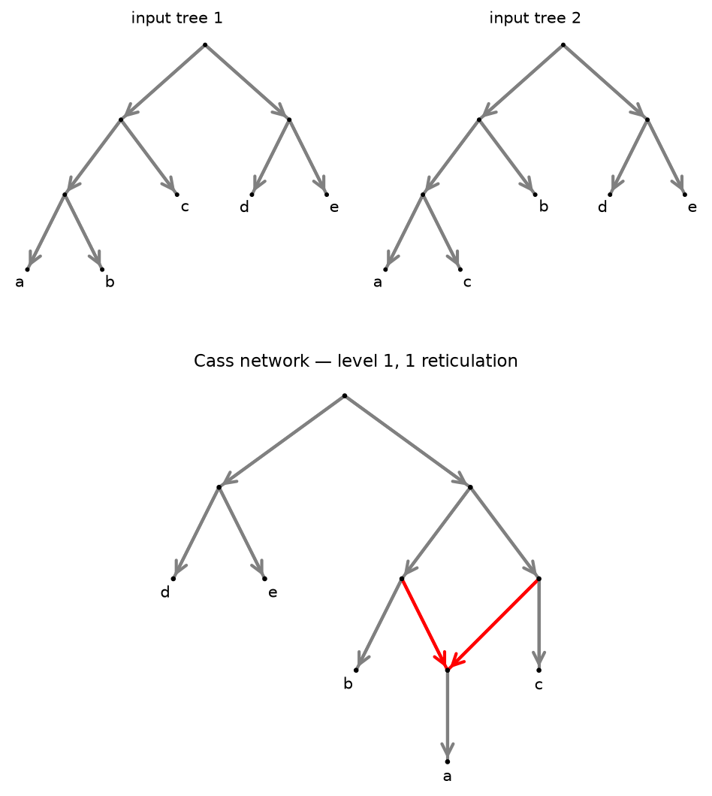

# PhyloCass

The **Cass** algorithm, implemented on top of [PhyloZoo](https://github.com/nholtgrefe/phylozoo).

> L. van Iersel, S. Kelk, R. Rupp, D. Huson.
> *Phylogenetic Networks Do not Need to Be Complex: Using Fewer Reticulations to Represent Conflicting Clusters.*
> Bioinformatics **26**(12):i124–i131, 2010 ([arXiv:0910.3082](https://arxiv.org/abs/0910.3082))

Cass takes a set of rooted phylogenetic trees, collects every cluster those
trees display, and builds a single rooted phylogenetic network that represents
**all** of those clusters in the softwired sense — while keeping the *level* of
the network as low as it can.

The level is the largest number of reticulations inside any single biconnected
component. Minimising it, rather than the total reticulation number, is what
lets Cass produce networks that stay readable even when the input trees
disagree a lot.

Results come back as PhyloZoo `DirectedPhyNetwork` objects, so they drop
straight into the rest of that ecosystem — plotting, format conversion,
displayed trees, quartets, and so on.

## Install

```bash
python -m venv .venv
source .venv/bin/activate          # Windows: .venv\Scripts\Activate.ps1
pip install -e ".[viz]"            # or just ".[dev]" / "." without plotting
```

Pulls in `phylozoo>=0.2.6`. Python 3.10+. Installing puts a `phylocass`
command on your path (inside the environment); `python -m phylocass` does the
same thing if you would rather not activate anything.

<details>
<summary>Windows: "running scripts is disabled on this system"</summary>

PowerShell refuses to run `Activate.ps1` when the execution policy is
`Restricted`, which is the default on Windows client editions. Check with
`Get-ExecutionPolicy -List` — if every scope says `Undefined`, that default is
what applies.

You do not have to activate anything; the launchers in the environment work
directly, and need no policy change at all:

```powershell
.\.venv\Scripts\phylocass.exe examples\conflicting_trees.newick
.\.venv\Scripts\python.exe -m pytest
```

To activate anyway, allow local scripts for this window:

```powershell
Set-ExecutionPolicy -Scope Process RemoteSigned
```

or once and for all for your user (no administrator rights needed):

```powershell
Set-ExecutionPolicy -Scope CurrentUser RemoteSigned
```

`RemoteSigned` is enough — it only blocks *downloaded* unsigned scripts, and
the one in your environment is local. `cmd.exe` is unaffected either way:
`.venv\Scripts\activate.bat`.

</details>

## Command line

```bash
# from a file of Newick trees, one tree per ';'
phylocass examples/conflicting_trees.newick

# from an explicit cluster list, one cluster per line
phylocass --format clusters examples/figure1_clusters.txt

# from stdin
echo '((a,b),(c,d)); ((a,c),(b,d));' | phylocass

# write the network out through PhyloZoo (.enewick/.nwk, or .dot)
phylocass examples/double_conflict.newick --out network.enewick
```

The network goes to stdout and a summary to stderr, so
`phylocass in.newick > out.enewick` gives you just the network:

```
# taxa=4 clusters=4 level=2 reticulations=2 verified=True
(((d,(b)#H2),((a)#H1,c)),(#H1,#H2));
```

Output is deterministic: the same input always gives the same network, whatever
the cluster ordering or Python's hash seed.

Exit codes are `0` on success, `2` for unusable input (missing file, malformed
Newick, nothing to do) and `1` when the search gives up under `--max-level` or
`--time-limit`. Input is always read as UTF-8, and a byte-order mark is
ignored, so piping from PowerShell and files saved by Notepad both work.

## Library

```python
from phylocass import read_trees, cass_from_trees

trees = read_trees("""
    (((a,b),c),d);
    (((a,c),b),d);
""")

result = cass_from_trees(trees)
result.level                 # 1
result.reticulation_number   # 1
result.to_enewick()          # '(d,((b,(a)#H1),(c,#H1)));'
result.represents_input()    # True

result.network               # a phylozoo DirectedPhyNetwork
result.network.validate()
sorted(result.network.taxa)  # ['a', 'b', 'c', 'd']
```

Or start from clusters directly:

```python
from phylocass import cass

result = cass({frozenset("ab"), frozenset("bc")}, taxa=frozenset("abcd"))
```

Because the result is an ordinary PhyloZoo network, everything PhyloZoo offers
applies to it:

```python
from phylozoo.core.network.dnetwork.derivations import displayed_trees
from phylozoo.core.network.dnetwork.classifications import level

[t.to_string() for t in displayed_trees(result.network)]
level(result.network)
result.network.save("out.dot")
```

`result.represents_input()` re-checks the finished network against the input
clusters through PhyloZoo's `displayed_trees` — a different code path from the
one the search uses, so it is a genuine verification rather than a restatement.

## Worked example: trees in, network out, drawn

Two gene trees that agree that `d` and `e` are sisters but disagree about where
`a` belongs — one groups it with `b`, the other with `c`. No single tree
displays both `{a,b}` and `{a,c}`, so Cass resolves the conflict with one
reticulation.

```python
import matplotlib.pyplot as plt
from phylozoo.viz import plot

from phylocass import cass_from_trees, read_trees

trees = read_trees("""
    (((a,b),c),(d,e));
    (((a,c),b),(d,e));
""")

result = cass_from_trees(trees)

print(result.level)                # 1
print(result.reticulation_number)  # 1
print(result.to_enewick())         # ((d,e),((b,(a)#H1),(#H1,c)));
print(result.represents_input())   # True

# result.network is a PhyloZoo DirectedPhyNetwork, so PhyloZoo draws it
ax = plot(result.network)
ax.set_title(f"level {result.level}, {result.reticulation_number} reticulation")
plt.savefig("network.png", dpi=150, bbox_inches="tight")
plt.show()
```

`plot` needs PhyloZoo's plotting extra:

```bash
pip install "phylocass[viz]"      # or: pip install "phylozoo[viz]"
```

[`examples/plot_network.py`](examples/plot_network.py) is the runnable version,
which also draws the input trees next to the result:

```bash
python examples/plot_network.py                                 # the example above
python examples/plot_network.py examples/double_conflict.newick # a level-2 case
python examples/plot_network.py my_trees.newick -o out.png --show
```



Reticulation edges are red by default. The one reticulation has two incoming
edges, and switching on one or the other recovers exactly the two input trees:

```python
from phylozoo.core.network.dnetwork.derivations import displayed_trees

[t.to_string() for t in displayed_trees(result.network)]
# ['((d,e),(b,(a,c)));', '((d,e),(c,(a,b)));']
```

Those are the input trees written with a different child order — the same two
cluster sets. Nothing was lost and nothing spurious was added.

`plot` takes a matplotlib `ax`, a layout name and a style object, so it composes
normally:

```python
from phylozoo.viz.dnetwork import DNetStyle

fig, (left, right) = plt.subplots(1, 2, figsize=(11, 4))
plot(trees[0], ax=left)
plot(result.network, ax=right, style=DNetStyle(hybrid_edge_color="crimson", node_size=300))
for ax in (left, right):
    ax.set_axis_off()
```

Layouts other than the default `'pz-dag'` are available: any NetworkX layout
(`'spring'`, `'circular'`, `'kamada_kawai'`, …) works out of the box, and the
Graphviz layouts (`'dot'`, `'neato'`, …) work if `pygraphviz` is installed —
without it, `plot(net, layout='dot')` raises `PhyloZooImportError`. For a
network with several tangled reticulations, `layout='dot'` is often easier to
read than the default.

If you would rather draw it elsewhere, save in a format another tool
understands:

```python
result.network.save("network.enewick")   # eNewick, e.g. for Dendroscope
result.network.save("network.dot")       # DOT, e.g. for Graphviz or Gephi
```

## Displaying the trees, not just their clusters

By default Cass does what the paper describes: every input cluster must be
represented by **some** switching of the network. Two clusters of the same
input tree are free to need *different* switchings — so the network represents
all the clusters without necessarily displaying any of the trees they came
from.

Setting `display_trees` strengthens the requirement: all clusters of one input
tree must appear in **one and the same** switching. That switching's tree then
displays the input tree, so the network displays the trees themselves. Its
reticulation number is therefore an upper bound on the **hybridization number**
of the input trees, which turns Cass into a heuristic for Hybridization Number
on multiple trees.

```bash
phylocass examples/three_trees.newick                  # level 2, 2 reticulations
phylocass examples/three_trees.newick --display-trees  # level 3, 3 reticulations
```

```python
from phylocass import CassOptions, cass_from_trees, read_tree_file

trees = read_tree_file("examples/three_trees.newick")

plain = cass_from_trees(trees)
plain.reticulation_number       # 2
plain.represents_input()        # True  - all clusters are there
plain.displays_input_trees()    # False - but not one switching per tree

hybrid = cass_from_trees(trees, CassOptions(display_trees=True))
hybrid.reticulation_number      # 3  <- heuristic bound on the hybridization number
hybrid.displays_input_trees()   # True
```

Those three trees are the smallest case in `examples/` where the modes differ:
they agree that `d` and `e` are sisters but each place `a` somewhere else.

`displays_input_trees()` is checked through PhyloZoo's `displayed_trees`, so it
verifies the finished network independently of the search — and it is worth
calling in either mode, since cluster mode often happens to display the trees
anyway. It returns `None` when Cass was handed a bare cluster set, because
then nothing records which cluster came from which tree.

### What to expect

On random inputs, display mode cost **no extra reticulations at all for two
trees** (40/40 cases), and one or two extra for three and four trees (20 of 31
cases). Two trees rarely need the option; three or more often do.

Two caveats worth stating plainly:

- **It is a heuristic, with no optimality guarantee.** The paper's exactness
  results are about cluster mode. Worse, its decomposition theorem is about
  *level*, and the paper notes explicitly that the analogous statement for
  reticulation number does **not** hold — so splitting the problem along the
  incompatibility graph, which is what makes Cass fast, is itself an
  approximation when you are counting reticulations. Treat the number as an
  upper bound produced by a heuristic, not as the hybridization number.
- **It is slower, and climbs higher.** A stronger acceptance test rejects more
  candidates, so the search reaches further up the levels; expect to raise
  `max_level` and to want a `time_limit`.

If your input trees do not all have the same taxon set, the check still
compares cluster sets, which is the natural reading but is not the same as
displaying each tree on its own taxon set. Restrict the trees to their common
taxa first if that distinction matters to you.

## What the guarantees are

| input | Cass gives you |
| --- | --- |
| clusters that fit a tree | that tree, level 0 |
| a level-1 network exists | a level-1 network (**proved**) |
| a level-2 network exists | a level-2 network (**proved**) |
| otherwise | a low-level network, in practice far below galled-network methods — but **not proved optimal** |
| `display_trees=True` | a network displaying the input trees — **heuristic**, no optimality claim |

The paper conjectures Cass is optimal at every level and proves a decomposition
theorem supporting that, but only levels 1 and 2 are settled.
`CassOptions.max_level` (default 4) bounds how far the search climbs.

## How it works

Two halves, matching the paper.

**Decomposition (Section 3, Steps 1–4)** — in [`cass.py`](src/phylocass/cass.py).
The incompatibility graph `IG(C)` has the clusters as nodes and joins two
clusters that overlap without nesting. Each non-trivial connected component
becomes an independent subproblem: collapse the maximal unseparated subsets of
its support, solve it, build the tree on everything left over, then splice each
component's network into that tree at the LCA of its taxa. Theorem 1 of the
paper is what makes this safe — if any level-*k* network exists, one respecting
this decomposition exists.

**Simple level-*k* networks (Section 4, Algorithm 1)** — also in `cass.py`, as
`_SimpleSearch`. Loop over the taxa; for each, delete it from every cluster and
collapse the maximal ST-sets of what remains. Do that *k* times and only two
taxa are left. Then walk back out: decollapse each ST-set leaf into its strict
subtree, and hang the removed taxon below a new reticulation fed by every
possible pair of edges, keeping any network that represents the clusters at
that level.

Display mode changes exactly one thing in that picture: the acceptance test.
Each cluster is tagged with the trees it came from, and that tag survives every
step of the recursion — a cluster is removed, collapsed and projected in step
with the tree it belongs to — so at the point where Cass asks "does this
network represent the clusters?", it can instead ask "does one switching
account for the whole of each tree?". Nothing else about the search changes.
Within a component the requirement is restricted to the clusters that component
holds; switchings in different biconnected components are independent, so one
switching per component composes into a single global switching per tree, and
clusters that sit on the backbone tree hold under every switching anyway.

Two details from the paper that are easy to miss, and that PhyloCass
implements:

- a **dummy taxon** `d` is offered alongside the real taxa at every round, and
  when `d` is the one removed the collapse step is deliberately skipped. This
  is what lets Cass build reticulations of indegree 3: hang `d`, hang the real
  taxon, delete `d`, and contract the edge left between the two reticulations.
- every tree built at the base of the recursion gets a **dummy root** above its
  real root, so a reticulation edge can also attach above the root. Both
  dummies are stripped on output.

## How PhyloZoo is used

PhyloZoo supplies the graph layer, the structural analysis and all I/O.
PhyloCass adds the cluster combinatorics, which PhyloZoo does not cover, and
the search itself.

| concern | comes from |
| --- | --- |
| (e)Newick and DOT parsing and writing | PhyloZoo `DirectedPhyNetwork` I/O |
| drawing | PhyloZoo `viz.plot` (matplotlib) |
| network validation | PhyloZoo `validate()` |
| level, reticulation number | PhyloZoo `classifications` |
| displayed trees (verification) | PhyloZoo `derivations.displayed_trees` |
| biconnected components, cut-edges | PhyloZoo `d_multigraph.features` |
| degree-2 suppression, parallel edges | PhyloZoo `d_multigraph.transformations` |
| mutable graph engine | PhyloZoo `DirectedMultiGraph` |
| partitions | PhyloZoo `Partition` |
| clusters, compatibility, ST-sets, `Collapse` | PhyloCass [`clusters.py`](src/phylocass/clusters.py) |
| the Cass search | PhyloCass [`cass.py`](src/phylocass/cass.py) |

### Why there is a `WorkGraph`

`DirectedPhyNetwork` is immutable and validates node degrees: internal nodes
must be tree nodes (in-degree 1, out-degree ≥ 2) or hybrid nodes (in-degree ≥ 2,
out-degree 1). **Every intermediate state of the Cass construction violates
that** — subdividing an edge creates a degree-2 node, and the algorithm parks
dummy leaves and a dummy root that only make sense mid-search.

So the search runs on PhyloZoo's mutable `DirectedMultiGraph` primitive,
wrapped as [`WorkGraph`](src/phylocass/workgraph.py), and a validated
`DirectedPhyNetwork` is materialised only once a candidate has been cleaned up.
That the hand-off succeeds is itself a check: if Cass produced something
malformed, PhyloZoo rejects it.

`WorkGraph` computes softwired clusters itself rather than calling
`displayed_trees`, for two reasons: mid-search graphs are not valid networks,
and it is the hot loop of the whole algorithm. The test suite pins that routine
against `displayed_trees` on finished networks so the shortcut cannot drift.

### Module map

| file | contents |
| --- | --- |
| [`clusters.py`](src/phylocass/clusters.py) | compatibility, incompatibility graph, ST-sets, `Collapse` |
| [`workgraph.py`](src/phylocass/workgraph.py) | the mutable search representation, and the hand-off to PhyloZoo |
| [`treebuild.py`](src/phylocass/treebuild.py) | the unique tree representing a compatible cluster set |
| [`io.py`](src/phylocass/io.py) | multi-tree reading, cluster extraction |
| [`cass.py`](src/phylocass/cass.py) | the algorithm |
| [`cli.py`](src/phylocass/cli.py) | command line |

### A note on the representation

Collapsing taxa into groups happens over and over in this algorithm. Rather
than minting composite taxon names, PhyloCass keeps every cluster written in
terms of the *original* taxa and tracks the current level of collapsing as a
separate partition into **blocks** — a block being a `frozenset` of original
taxa that currently acts as one taxon. Restriction, deletion and the
"does this network represent C?" test then need no translation layer at all.
Leaf blocks double as leaf labels; the empty block marks a dummy leaf, which
therefore contributes nothing to any descendant set for free.

## Performance

Cass runs in `O(|X|^(3k+2) · |C|)` time for fixed level *k* — polynomial, but
the exponent bites. `CassOptions` gives you three brakes:

```python
from phylocass import cass, CassOptions

result = cass(clusters, taxa, CassOptions(
    max_level=3,        # give up above this level
    time_limit=60.0,    # seconds per conflicting component, shared across levels
    max_networks=5000,  # intermediate networks kept per subproblem
))
```

`time_limit` is one budget for a whole component, not a fresh allowance at each
level the search climbs through. When a component exhausts its budget or
exceeds `max_level`, `cass` raises `RuntimeError` naming the component's size
and which limit it hit.

The decomposition means cost is driven by the largest *conflicting component*,
not by the total number of taxa — a 200-taxon dataset whose disagreements are
local stays fast. On this machine, levels 0–2 return in well under a second;
level 4 on 6–7 mutually conflicting taxa takes seconds to tens of seconds,
which is the exponent showing up rather than anything avoidable.

## Tests

```bash
pip install -e ".[dev]"
pytest
```

Three kinds of test carry the weight:

- **Round-trips.** Generate a random network of level ≤ 2, take the clusters it
  displays, run Cass on them, and require a network of no higher level
  displaying every one of them. This tests the paper's exactness guarantee
  directly rather than comparing against hard-coded output.
- **Agreement with PhyloZoo.** The search's own softwired-cluster and level
  routines are checked against PhyloZoo's `displayed_trees` and `level` on
  random networks, and every finished network must pass `validate()`.
- **The paper's example.** The nine-taxon cluster set from Figure 1 reproduces
  the level-2, two-reticulation network the paper reports, where the
  galled-network algorithm needs four reticulations.
- **Determinism.** Repeated runs, shuffled input, and subprocesses started
  under different `PYTHONHASHSEED` values must all agree.

The worked example above is tested too, down to the eNewick string quoted in
this README, so the documentation cannot drift from the code. Plotting tests
skip themselves if the `viz` extra is not installed.

## Licence

MIT. PhyloZoo is MIT-licensed as well; if you use this, cite both the Cass
paper above and the PhyloZoo preprint
([bioRxiv:10.64898/2026.06.09.731120](https://doi.org/10.64898/2026.06.09.731120)).
